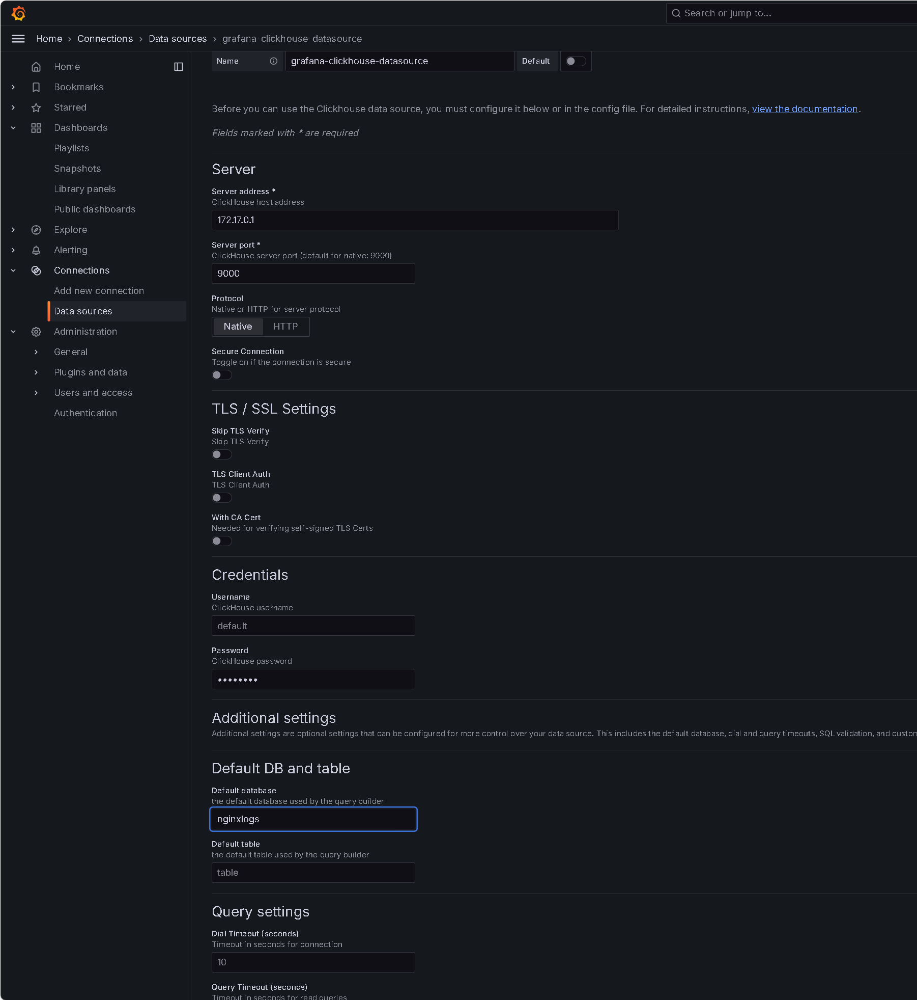
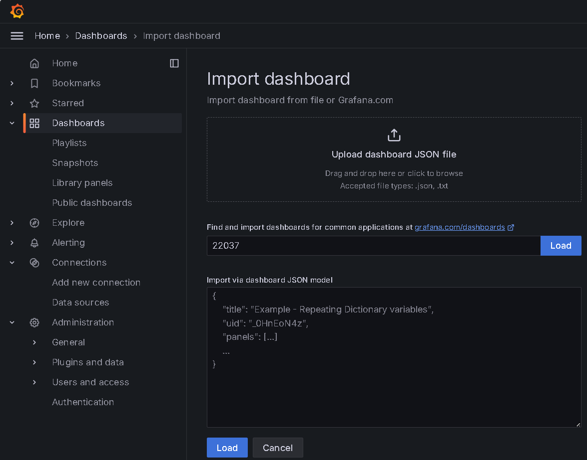
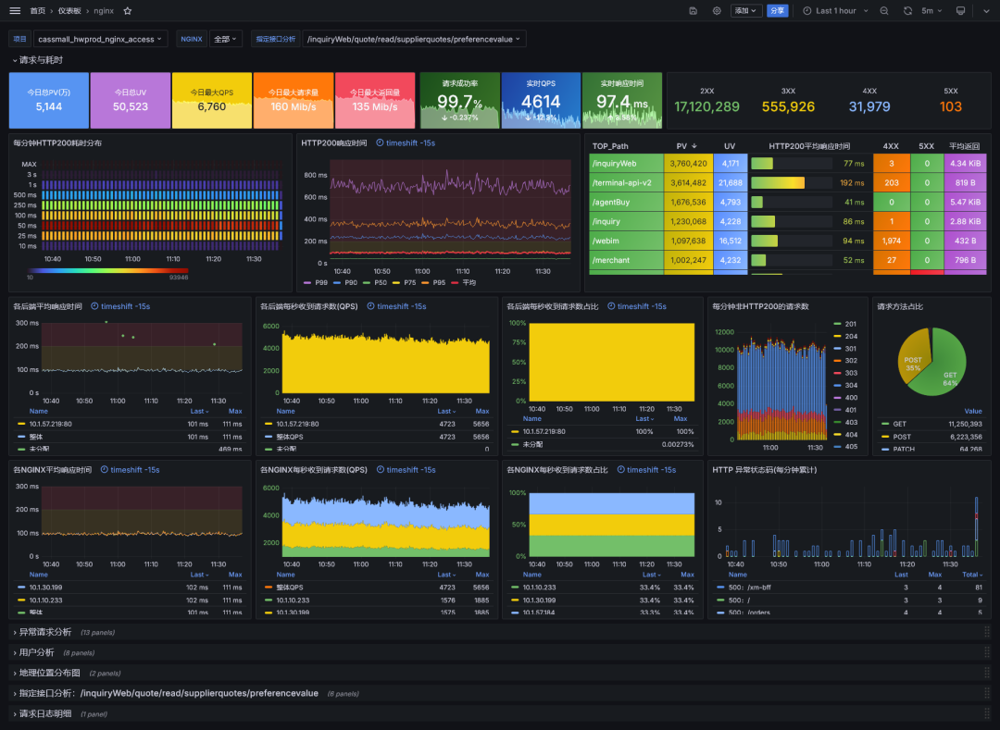
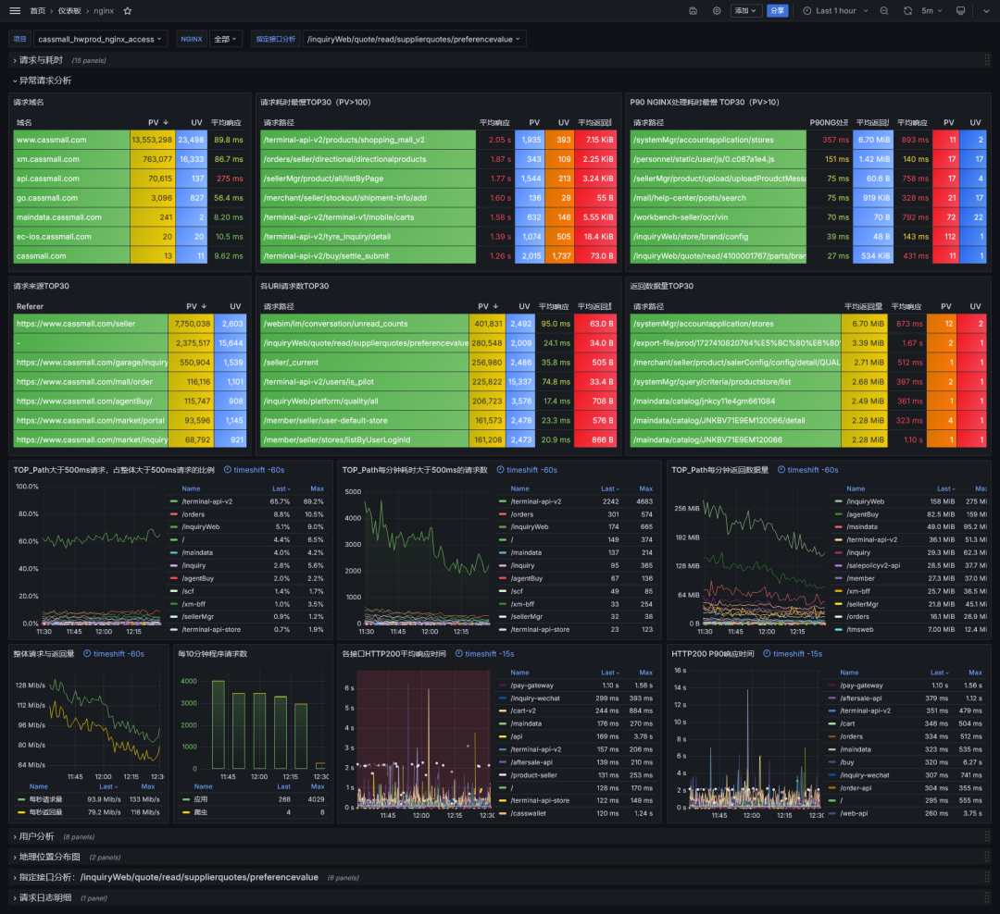
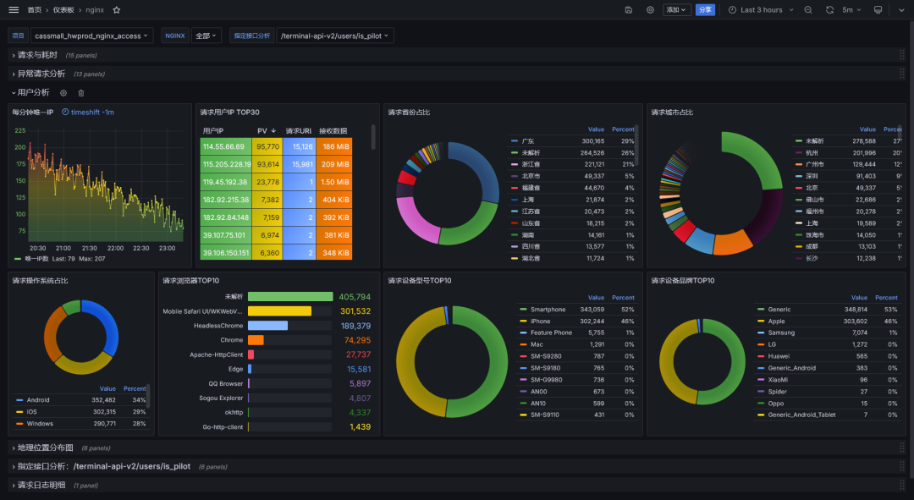
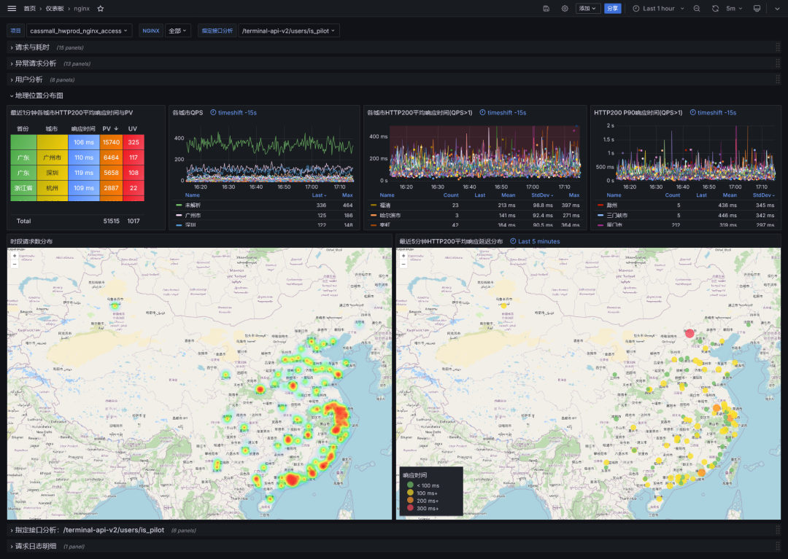
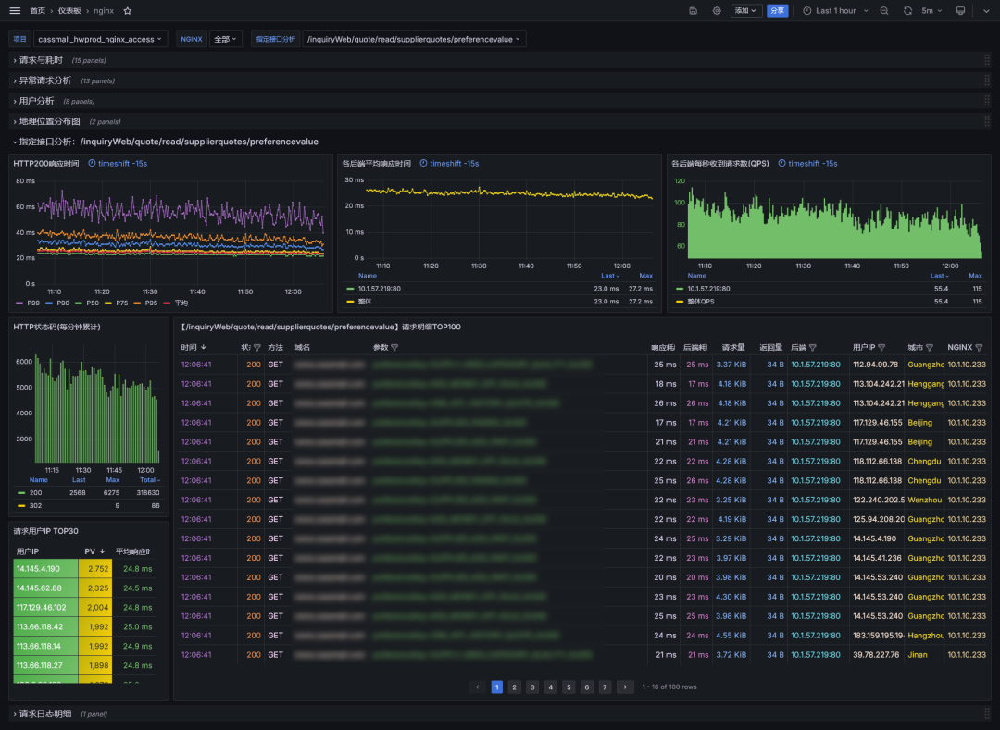
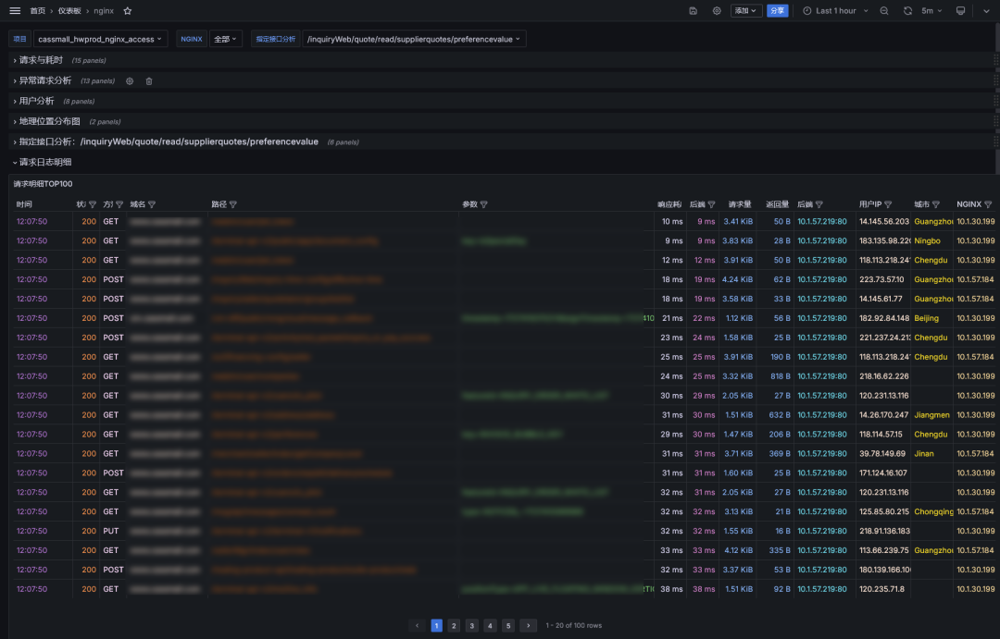

# 介绍

## Nginx

### 安装
> 官方文档: https://nginx.org/en/linux_packages.html#Ubuntu

```bash
sudo apt install curl gnupg2 ca-certificates lsb-release ubuntu-keyring
curl https://nginx.org/keys/nginx_signing.key | gpg --dearmor \
    | sudo tee /usr/share/keyrings/nginx-archive-keyring.gpg >/dev/null
gpg --dry-run --quiet --no-keyring --import --import-options import-show /usr/share/keyrings/nginx-archive-keyring.gpg
echo "deb [signed-by=/usr/share/keyrings/nginx-archive-keyring.gpg] \
http://nginx.org/packages/ubuntu `lsb_release -cs` nginx" \
    | sudo tee /etc/apt/sources.list.d/nginx.list
echo -e "Package: *\nPin: origin nginx.org\nPin: release o=nginx\nPin-Priority: 900\n" \
    | sudo tee /etc/apt/preferences.d/99nginx
sudo apt update
sudo apt install nginx -y
systemctl start nginx
```

### 配置Nginx

编辑nginx.conf，增加以下配置
```bash
vim /etc/nginx/nginx.conf
    map "$time_iso8601 # $msec" $time_iso8601_ms { "~(^[^+]+)(\+[0-9:]+) # \d+\.(\d+)$" $1.$3$2; }
    log_format main
        '{"timestamp":"$time_iso8601_ms",'
        '"server_ip":"$server_addr",'
        '"remote_ip":"$remote_addr",'
        '"xff":"$http_x_forwarded_for",'
        '"remote_user":"$remote_user",'
        '"domain":"$host",'
        '"url":"$request_uri",'
        '"referer":"$http_referer",'
        '"upstreamtime":"$upstream_response_time",'
        '"responsetime":"$request_time",'
        '"request_method":"$request_method",'
        '"status":"$status",'
        '"response_length":"$bytes_sent",'
        '"request_length":"$request_length",'
        '"protocol":"$server_protocol",'
        '"upstreamhost":"$upstream_addr",'
        '"http_user_agent":"$http_user_agent"'
        '}';
```

### 重载配置

```bash
systemctl start nginx
```

## 安装Docker

> https://docs.docker.com/engine/install/ubuntu/

```bash
for pkg in docker.io docker-doc docker-compose docker-compose-v2 podman-docker containerd runc; do sudo apt-get remove $pkg; done
# Add Docker's official GPG key:
sudo apt-get update
sudo apt-get install ca-certificates curl
sudo install -m 0755 -d /etc/apt/keyrings
sudo curl -fsSL https://download.docker.com/linux/ubuntu/gpg -o /etc/apt/keyrings/docker.asc
sudo chmod a+r /etc/apt/keyrings/docker.asc

# Add the repository to Apt sources:
echo \
  "deb [arch=$(dpkg --print-architecture) signed-by=/etc/apt/keyrings/docker.asc] https://download.docker.com/linux/ubuntu \
  $(. /etc/os-release && echo "$VERSION_CODENAME") stable" | \
  sudo tee /etc/apt/sources.list.d/docker.list > /dev/null
sudo apt-get update
sudo apt-get install docker-ce docker-ce-cli containerd.io docker-buildx-plugin docker-compose-plugin -y
```

## Clickhouse

### 创建部署目录和docker-compose.yaml
```bash
mkdir -p /opt/clickhouse/etc/clickhouse-server/{config.d,users.d}
cd /opt/clickhouse
cat <<-EOF > docker-compose.yaml
services:
  clickhouse:
    image: registry.cn-shenzhen.aliyuncs.com/starsl/clickhouse-server:23.4
    container_name: clickhouse
    hostname: clickhouse
    volumes:
      - /opt/clickhouse/logs:/var/log/clickhouse-server
      - /opt/clickhouse/data:/var/lib/clickhouse
      - /opt/clickhouse/etc/clickhouse-server/config.d/config.xml:/etc/clickhouse-server/config.d/config.xml
      - /opt/clickhouse/etc/clickhouse-server/users.d/users.xml:/etc/clickhouse-server/users.d/users.xml
      - /usr/share/zoneinfo/PRC:/etc/localtime
    ports:
      - 8123:8123
      - 9000:9000
EOF
```

### 配置主文件

```bash
vim /opt/clickhouse/etc/clickhouse-server/config.d/config.xml
<clickhouse replace="true">
    <logger>
        <level>debug</level>
        <log>/var/log/clickhouse-server/clickhouse-server.log</log>
        <errorlog>/var/log/clickhouse-server/clickhouse-server.err.log</errorlog>
        <size>1000M</size>
        <count>3</count>
    </logger>
    <display_name>ch_accesslog</display_name>
    <listen_host>0.0.0.0</listen_host>
    <http_port>8123</http_port>
    <tcp_port>9000</tcp_port>
    <user_directories>
        <users_xml>
            <path>users.xml</path>
        </users_xml>
        <local_directory>
            <path>/var/lib/clickhouse/access/</path>
        </local_directory>
    </user_directories>
</clickhouse>
```

### 配置用户文件

```bash
PASSWORD=$(base64 < /dev/urandom | head -c8); echo "$PASSWORD"; echo -n "$PASSWORD" | sha256sum | tr -d '-'
42ieYiyE
75f5da2928c7fd93ac68a4db853bb4b6374b1f169fbb49aff3c068b061921d84

vim /opt/clickhouse/etc/clickhouse-server/users.d/users.xml
<?xml version="1.0"?>
<clickhouse replace="true">
    <profiles>
        <default>
            <max_memory_usage>10000000000</max_memory_usage>
            <use_uncompressed_cache>0</use_uncompressed_cache>
            <load_balancing>in_order</load_balancing>
            <log_queries>1</log_queries>
        </default>
    </profiles>
    <users>
        <default>
            <password remove='1' />
            <password_sha256_hex>填写生成的密码密文{75f5da2928c7fd93ac68a4db853bb4b6374b1f169fbb49aff3c068b061921d84}</password_sha256_hex>
            <access_management>1</access_management>
            <profile>default</profile>
            <networks>
                <ip>::/0</ip>
            </networks>
            <quota>default</quota>
            <access_management>1</access_management>
            <named_collection_control>1</named_collection_control>
            <show_named_collections>1</show_named_collections>
            <show_named_collections_secrets>1</show_named_collections_secrets>
        </default>
    </users>
    <quotas>
        <default>
            <interval>
                <duration>3600</duration>
                <queries>0</queries>
                <errors>0</errors>
                <result_rows>0</result_rows>
                <read_rows>0</read_rows>
                <execution_time>0</execution_time>
            </interval>
        </default>
    </quotas>
</clickhouse>
```

### 启动

```bash
docker compose up -d
```

### 创建数据库与表

#### 进入ck数据库

```bash
docker container exec -it clickhouse clickhouse-client --user default --password 42ieYiyE
```

#### 执行创建语句

```clickhouse
CREATE DATABASE IF NOT EXISTS nginxlogs ENGINE=Atomic;

CREATE TABLE nginxlogs.nginx_access
(
    `timestamp` DateTime64(3, 'Asia/Shanghai'),
    `server_ip` String,
    `domain` String,
    `request_method` String,
    `status` Int32,
    `top_path` String,
    `path` String,
    `query` String,
    `protocol` String,
    `referer` String,
    `upstreamhost` String,
    `responsetime` Float32,
    `upstreamtime` Float32,
    `duration` Float32,
    `request_length` Int32,
    `response_length` Int32,
    `client_ip` String,
    `client_latitude` Float32,
    `client_longitude` Float32,
    `remote_user` String,
    `remote_ip` String,
    `xff` String,
    `client_city` String,
    `client_region` String,
    `client_country` String,
    `http_user_agent` String,
    `client_browser_family` String,
    `client_browser_major` String,
    `client_os_family` String,
    `client_os_major` String,
    `client_device_brand` String,
    `client_device_model` String,
    `createdtime` DateTime64(3, 'Asia/Shanghai')
)
ENGINE = MergeTree
PARTITION BY toYYYYMMDD(timestamp)
PRIMARY KEY (timestamp,
 server_ip,
 status,
 top_path,
 domain,
 upstreamhost,
 client_ip,
 remote_user,
 request_method,
 protocol,
 responsetime,
 upstreamtime,
 duration,
 request_length,
 response_length,
 path,
 referer,
 client_city,
 client_region,
 client_country,
 client_browser_family,
 client_browser_major,
 client_os_family,
 client_os_major,
 client_device_brand,
 client_device_model
)
TTL toDateTime(timestamp) + toIntervalDay(30)
SETTINGS index_granularity = 8192;
```

## 部署Vector采集日志

### Vector部署

```bash
# 创建部署目录和docker-compose.yaml
mkdir -p /opt/vector/conf
cd /opt/vector
touch access_vector_error.log
wget https://raw.githubusercontent.com/P3TERX/GeoLite.mmdb/download/GeoLite2-City.mmdb
cat <<-EOF > docker-compose.yaml
services:
  vector:
    image: registry.cn-shenzhen.aliyuncs.com/starsl/vector:0.41.1-alpine
    container_name: vector
    hostname: vector
    restart: always
    entrypoint: vector --config-dir /etc/vector/conf 
    ports:
      - 8686:8686
    volumes:
      - /var/log/nginx:/nginx_logs  # 这是需要采集的日志的路径需要挂载到容器内
      - /opt/vector/access_vector_error.log:/tmp/access_vector_error.log
      - /opt/vector/GeoLite2-City.mmdb:/etc/vector/GeoLite2-City.mmdb
      - /opt/vector/conf:/etc/vector/conf
      - /usr/share/zoneinfo/PRC:/etc/localtime
EOF
```

### Vector配置

```bash
cd /opt/vector/conf
cat <<-EOF > vector.yaml
timezone: "Asia/Shanghai"
api:
  enabled: true
  address: "0.0.0.0:8686"
EOF

vim nginx-access.yaml
sources:
  01_file_nginx_access:
    type: file
    include:
      - /nginx_logs/access.log  #nginx请求日志路径
transforms:
  02_parse_nginx_access:
    drop_on_error: true
    reroute_dropped: true
    type: remap
    inputs:
      - 01_file_nginx_access
    source: |
      .message = string!(.message)
      if contains(.message,"\\x") { .message = replace(.message, "\\x", "\\\\x") }
      . = parse_json!(.message)
      .createdtime = to_unix_timestamp(now(), unit: "milliseconds")
      .timestamp = to_unix_timestamp(parse_timestamp!(.timestamp , format: "%+"), unit: "milliseconds")
      .url_list = split!(.url, "?", 2)
      .path = .url_list[0]
      .query = .url_list[1]
      .path_list = split!(.path, "/", 3)
      if length(.path_list) > 2 {.top_path = join!(["/", .path_list[1]])} else {.top_path = "/"}
      .duration = round(((to_float(.responsetime) ?? 0) - (to_float(.upstreamtime) ?? 0)) ?? 0,3)
      if .xff == "-" { .xff = .remote_ip }
      .client_ip = split!(.xff, ",", 2)[0]
      .ua = parse_user_agent!(.http_user_agent , mode: "enriched")
      .client_browser_family = .ua.browser.family
      .client_browser_major = .ua.browser.major
      .client_os_family = .ua.os.family
      .client_os_major = .ua.os.major
      .client_device_brand = .ua.device.brand
      .client_device_model = .ua.device.model
      .geoip = get_enrichment_table_record("geoip_table", {"ip": .client_ip}) ?? {"city_name":"unknown","region_name":"unknown","country_name":"unknown"}
      .client_city = .geoip.city_name
      .client_region = .geoip.region_name
      .client_country = .geoip.country_name
      .client_latitude = .geoip.latitude
      .client_longitude = .geoip.longitude
      del(.path_list)
      del(.url_list)
      del(.ua)
      del(.geoip)
      del(.url)
sinks:
  03_ck_nginx_access:
    type: clickhouse
    inputs:
      - 02_parse_nginx_access
    endpoint: http://10.7.0.26:8123  #clickhouse http接口
    database: nginxlogs  #clickhouse 库
    table: nginx_access  #clickhouse 表
    auth:
      strategy: basic
      user: default  #clickhouse 库
      password: GlWszBQp  #clickhouse 密码
    compression: gzip
  04_out_nginx_dropped:
    type: file
    inputs:
      - 02_parse_nginx_access.dropped
    path: /tmp/access_vector_error.log  #解析异常的日志
    encoding:
      codec: json
enrichment_tables:
  geoip_table:
    path: "/etc/vector/GeoLite2-City.mmdb"
    type: geoip
    locale: "zh-CN"
```

### 运行Vector

```bash
docker compose up -d
```

## grafana

### 运行grafana
```bash
docker run -d --name=grafana -p 3000:3000 grafana/grafana
```

### 配置ClickHouse

#### 安装插件

```bash
docker container exec -it grafana grafana cli plugins install grafana-clickhouse-datasource
docker restart grafana
```

#### 增加数据源



#### 导入看板




#### Grafana 请求日志分析看板预览

该看板是基于 ClickHouse + Vector 的 NGINX 请求日志分析看板。包括请求与耗时分析、异常请求分析、用户分析、地理位置分布图、指定接口分析、请求日志明细。

**尤其在异常请求分析方面，总结多年异常请求分析经验，从各个角度设计大量异常请求的分析图表。**  

*   整体请求与耗时分析
    



*   NGINX 异常请求分析
    



*   用户请求数据分析
    



*   地理位置数据分析
    



*   指定接口明细分析
    



*   请求日志详情分析
    



# 参考文档
https://mp.weixin.qq.com/s/6VSwFCfK0G_QQUjMnLs9Dw