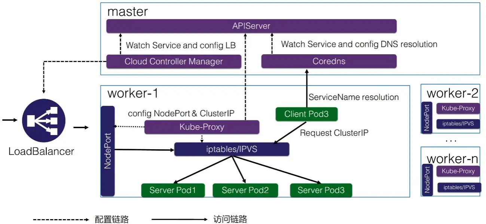

# coredns解析超时问题


> 本文由 [简悦 SimpRead](http://ksria.com/simpread/) 转码， 原文地址 [www.jianshu.com](https://www.jianshu.com/p/f6b46fe2cbfb)

> 本文结合**域名请求慢的问题**，从**虚拟网络**定位到**域名解析**，根据 **coredns 添加域名后缀的机制**，定位 coredns 解析慢的根因。

1. 问题现象
=======

**背景**：项目是微服务 + flink，其中 flink 采用 k8s session standalone 的部署模式。  
**问题**：微服务通过 flink restful api 启动作业的平均时长超过 40s，导致客户端超时和作业失联。

```
#为了排除 flink 内部启动作业耗时因素，使用 /jobs/overview 测试微服务到 flink 的网络耗时
$time curl http://flink-jobmanager.default.svc.cluster.local:8091/jobs/overview
{"jobs":[{"jid":"0bf232afb7febbb8b070221833ddb99c","name":"TopSpeedWindowing","state":"RUNNING","start-time":1631687894914,"end-time":-1,"duration":701488855,"last-modification":1631687895895,"tasks":{"total":3,"created":0,"scheduled":0,"deploying":0,"running":3,"finished":0,"canceling":0,"canceled":0,"failed":0,"reconciling":0}}]}
real    0m10.528s
user    0m0.004s
sys     0m0.005s


```

2. 根因定位
=======

> 定位思路：理解 Service [【K8s 精选】Kubernetes Service 介绍](https://www.jianshu.com/p/84b55b7cfa65)。**在使用 service name 即域名的场景下，Client Pod3 首先拿着域名去 coredns 解析成 ClusterIP，接着去请求 ClusterIP，最后通过 Kube-Proxy 把请求转发到目标后端 Pod。**  
> 
>  Kubernetes 服务发现架构. JPG

2.1 虚拟化网络分析
-----------

#### 2.1.1 curl 命令详解

参考 [curl 命令详解](https://www.jianshu.com/p/25746a2f89bc)，例如

```
curl --header "Content-Type: application/json"  -X POST   --data '{"text":"germany"}'   https://labs.tib.eu/falcon/api?mode=short


```

#### 2.1.2 curl 获取 http 各阶段的响应时间

参考[通过 curl 得到 http 各阶段的响应时间](https://links.jianshu.com/go?to=https%3A%2F%2Fblog.csdn.net%2Fhqzxsc2006%2Farticle%2Fdetails%2F50547684)

> ① **time_namelookup**：DNS 解析时间  
> ② **time_connect**：连接时间，从请求开始到 DNS 解析完毕所用时间。单纯的连接时间 = time_connect - time_namelookup  
> ③ **time_appconnect**：建立完成时间，例如 SSL/SSH 等建立连接或者完成三次握手的时间。  
> ④ **time_redirect**：重定向时间，包括最后一次传输前的几次重定向的 DNS 解析、连接、预传输、传输时间。  
> ⑤ **time_pretransfer**： 从开始到准备传输的时间。  
> ⑥ **time_starttransfer**：开始传输时间。在 client 发出请求后，服务端返回数据的第一个字节所用的时间。

进入业务容器，编辑完获取数据的格式后，执行 curl 命令。

> **/dev/null** 表示空设备，即丢弃一切写入的数据，但显示写入操作成功。

```
$vim curl-format.txt

time_namelookup: %{time_namelookup}\n
time_connect: %{time_connect}\n
time_appconnect: %{time_appconnect}\n
time_redirect: %{time_redirect}\n
time_pretransfer: %{time_pretransfer}\n
time_starttransfer: %{time_starttransfer}\n
----------\n
time_total: %{time_total}\n


```

```
$kubectl get svc |grep flink
flink-jobmanager                          ClusterIP   10.96.0.123   <none>        8123/TCP,8124/TCP,8091/TCP   4d22h
# 首先使用 ClusterIP 测试接口调用时长
$curl -w "@curl-format.txt" -o /dev/null -l "http://10.96.0.123:8091/jobs/overview"
  % Total    % Received % Xferd  Average Speed   Time    Time     Time  Current
                                 Dload  Upload   Total   Spent    Left  Speed
100   660  100   660    0     0  81865      0 --:--:-- --:--:-- --:--:-- 94285
time_namelookup: 0.004
time_connect: 0.005
time_appconnect: 0.000
time_redirect: 0.000
time_pretransfer: 0.005
time_starttransfer: 0.008
----------
time_total: 0.008

# 然后使用 service name 即域名测试接口调用时长
$curl -w "@curl-format.txt" -o /dev/null -l "http://flink-jobmanager.default.svc.cluster.local:8091/jobs/overview"
  % Total    % Received % Xferd  Average Speed   Time    Time     Time  Current
                                 Dload  Upload   Total   Spent    Left  Speed
100   660  100   660    0     0     62      0  0:00:10  0:00:10 --:--:--   164
time_melookup: 10.516
time_connect: 10.517
time_appconnect: 0.000
time_redirect: 0.000
time_pretransfer: 10.517
time_starttransfer: 10.520
----------
time_total: 10.520


```

对比 ClusterIP 和 service name 的接口调用时长，由 **time_namelookup** 可知 DNS 解析时间长。

2.2 域名解析分析
----------

### 2.2.1 外部分析 - coredns 解析域名

```
$kubectl logs coredns-66509f5cf2-km1q4 -nkube-system
2021-09-23T01:54:04.590Z [ERROR] plugin/errors: 2 flink-jobmanager.default.svc.cluster.local.openstacklocal. A: read udp 10.244.0.18:32960->100.79.1.250:53: i/o timeout
2021-09-23T01:54:09.592Z [ERROR] plugin/errors: 2 flink-jobmanager.default.svc.cluster.local.openstacklocal. A: read udp 10.244.0.18:59978->100.79.1.250:53: i/o timeout
2021-09-23T01:56:00.609Z [ERROR] plugin/errors: 2 flink-jobmanager.default.svc.cluster.local.openstacklocal. AAAA: read udp 10.244.2.19:41797->100.79.1.250:53: i/o timeout
2021-09-23T01:56:02.610Z [ERROR] plugin/errors: 2 flink-jobmanager.default.svc.cluster.local.openstacklocal. AAAA: read udp 10.244.2.19:48375->100.79.1.250:53: i/o timeout


```

由 coredns 后台关键日志 **A: read udp xxx->xxx: i/o timeout** 可知 IPV4 解析超时，**AAAA: read udp xxx->xxx: i/o timeout** 可知 IPV6 解析也超时。

##### IPV4 和 IPV6 耗时对比

```
# IPV4 请求耗时
$curl -4 -w "@curl-format.txt" -o /dev/null -l "http://flink-jobmanager.default.svc.cluster.local:8091/jobs/overview"
  % Total    % Received % Xferd  Average Speed   Time    Time     Time  Current
                                 Dload  Upload   Total   Spent    Left  Speed
  0     0    0     0    0     0      0      0 --:--:--  0:00:03 --:--:--     0
time_melookup: 0.000
time_connect: 0.000
time_appconnect: 0.000
time_redirect: 0.000
time_pretransfer: 0.000
time_starttransfer: 0.000
----------
time_total: 3.510

# IPV6 请求耗时
$curl -6 -w "@curl-format.txt" -o /dev/null -l "http://flink-jobmanager.default.svc.cluster.local:8091/jobs/overview"
  % Total    % Received % Xferd  Average Speed   Time    Time     Time  Current
                                 Dload  Upload   Total   Spent    Left  Speed
100   660  100   660    0     0    146      0  0:00:04  0:00:04 --:--:--   146
time_melookup: 4.511
time_connect: 4.512
time_appconnect: 0.000
time_redirect: 0.000
time_pretransfer: 4.512
time_starttransfer: 4.515
----------
time_total: 4.515


```

结论：IPV6 解析比 IPV4 多耗时约 20%，说明 IPV6 对域名解析有一定的影响，建议 coredns 关闭 IPV6 解析。然而直接用 IPV4 解析也耗时 3s+，需要进一步对容器内部进行抓包分析。

> 建议：如果 IPV6 模式没有使用，可以关闭。

### 2.2.2 内部分析 - 容器内部解析域名

#### 通过宿主机抓起 Pod 网络数据报

**nsenter 可以进入 Pod 容器 net 命名空间，同时提供一个快速进入 Pod 容器 net 命名空间脚本**，可以参考[在容器环境使用 tcpdump 抓包](https://www.jianshu.com/p/d68ffe420578)

```
# 步骤1 获取容器的 pid
$ docker ps |grep flink-jobmanager-7b58565dc8-msgpp
1386ce6244ae        192.168.31.37:5000/flink                      "bash -cx /opt/flink/s…"   3 weeks ago         Up 3 weeks                              k8s_flink-jobmanager-7b58565dc8-msgpp_4b6d15d8-7b54-41fb-bf46-ffa91aa33963_0

$ docker inspect 1386ce6244ae| grep Pid
            "Pid": 63046,
            "PidMode": "",
            "PidsLimit": 0,

# 步骤2 根据 pid 执行命令
# 53 是 corends 域名解析端口 
$ nsenter -t 63046 -n
$ tcpdump 'src host 10.244.3.81 and src port 8091'

# 步骤3 打开新窗口，进入容器并执行上述的 curl 命令
$curl -w "@curl-format.txt" -o /dev/null -l "http://flink-jobmanager.default.svc.cluster.local:8091/jobs/overview"


```

下载 tcpdump 的抓包数据 xxx.pcap， [利用 wireshark 分析 tcpdump 报文](https://www.jianshu.com/p/2e36392c4ef7)，其结果如下：  
① **flink-jobmanager.default.svc.cluster.local** 域名解析成 ip 的时间约 10s  
② 在域名解析的过程中，在 flink-jobmanager.default.svc.cluster.local 的基础上，其后缀依次添加 **default.svc.cluster.local**、**svc.cluster.local**、**cluster.local**、**openstacklocal**

查看业务容器中的配置 **/etc/resolv.conf**，发现上述的后缀恰好是 search 内容。

```
$ cat /etc/resolv.conf
nameserver 10.96.0.10
search default.svc.cluster.local svc.cluster.local cluster.local openstacklocal
options ndots:5 single-request-reopen


```

3 容器 /etc/resolv.conf 配置分析
==========================

容器 /etc/resolv.conf 配置如下：

```
nameserver 10.96.0.10
search default.svc.cluster.local svc.cluster.local cluster.local openstacklocal
options ndots:5 single-request-reopen


```

### ① nameserver

resolv.conf 文件的第一行是 nameserver，内容是 **coredns 的 ClusterIP**

```
$kubectl get svc -nkube-system |grep dns
kube-dns   ClusterIP   10.96.0.10   <none>        53/UDP,53/TCP   167d


```

### ② search

resolv.conf 文件的第一行是 search。当域名解析的时候，将域名依次添加后缀，例如：

```
flink-jobmanager.default.svc.cluster.local.default.svc.cluster.local
flink-jobmanager.default.svc.cluster.local.svc.cluster.local
flink-jobmanager.default.svc.cluster.local.cluster.local
flink-jobmanager.default.svc.cluster.local.openstacklocal


```

### ③ options

resolv.conf 文件的第一行是 options 其它项，常见配置是 ndots。**ndots: 5 表示如果域名包含的 "." 少于 5 个，则先添加 search 后缀，再使用绝对域名；如果域名包含的 "." 大于等于 5 个，则先使用绝对域名，再添加 search 后缀**。

```
#样例1 域名a.b.c.d.e，则域名的顺序如下
a.b.c.d.e.default.svc.cluster.local
a.b.c.d.e.svc.cluster.local
a.b.c.d.e.cluster.local
a.b.c.d.e.openstacklocal
a.b.c.d.e

#样例2 域名a.b.c.d.e.f，则域名的顺序如下
a.b.c.d.e.f
a.b.c.d.e.f.default.svc.cluster.local
a.b.c.d.e.f.svc.cluster.local
a.b.c.d.e.f.cluster.local
a.b.c.d.e.f.openstacklocal


```

结合 flink-jobmanager.default.svc.cluster.local 域名解析慢的问题，由于该域名包含 "." 等于 4，即少于 5，所以会首先依次添加后缀 default.svc.cluster.local、svc.cluster.local、cluster.local openstacklocal。因此，解决方案有 ①**flink-jobmanager.default.svc.cluster.local 修改为 flink-jobmanager**；②**ndots: 5 修改为 ndots: 4**。

4 解决方案
======

### 4.1 使用简洁域名

将访问的域名从 **flink-jobmanager.default.svc.cluster.local 修改为 flink-jobmanager**，效果如下：

```
curl -w "@curl-format.txt" -o /dev/null -l "http://flink-jobmanager:8091/jobs/overview"
  % Total    % Received % Xferd  Average Speed   Time    Time     Time  Current
                                 Dload  Upload   Total   Spent    Left  Speed
100   660  100   660    0     0  82038      0 --:--:-- --:--:-- --:--:-- 94285
time_melookup: 0.004
time_connect: 0.005
time_appconnect: 0.000
time_redirect: 0.000
time_pretransfer: 0.005
time_starttransfer: 0.008
----------
time_total: 0.008


```

### 4.2 resolv.conf 配置更改

将 /etc/resolv.conf 的 options 配置 **ndots: 5 修改为 ndots: 4**，或者修改 deployment 的 yaml 配置，效果如下：

```
     # 修改 deployment 的 yaml 配置
     # spec.spec.dnsConfig.options[].ndots
      dnsConfig:
        options:
          - name: ndots
            value: 4
          - name: single-request-reopen


```

```
curl -w "@curl-format.txt" -o /dev/null -l "http://flink-jobmanager.default.svc.cluster.local:8091/jobs/overview"
  % Total    % Received % Xferd  Average Speed   Time    Time     Time  Current
                                 Dload  Upload   Total   Spent    Left  Speed
100   660  100   660    0     0  82038      0 --:--:-- --:--:-- --:--:-- 94285
time_melookup: 0.005
time_connect: 0.006
time_appconnect: 0.000
time_redirect: 0.000
time_pretransfer: 0.005
time_starttransfer: 0.008
----------
time_total: 0.008


```
